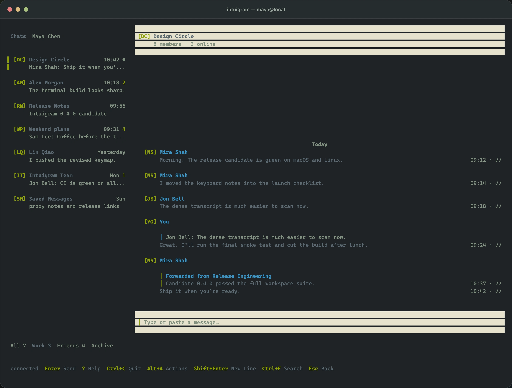

# Intuigram

Telegram in a TUI.

Intuigram is a local-first Telegram client. It makes routine messaging fast and keyboard-native. It keeps Chats, Messages, Drafts, and navigation state available. It connects directly to Telegram. It shows important information in a dense terminal interface.



## Why use Intuigram

- Move through Folders and Chats without a mouse.
- Keep the Composer ready while you read and reply to Messages.
- Show inline terminal graphics on supported terminals and show useful text fallbacks on all terminals.
- Paste text, copied files, and images into the Composer without replacing the Draft caption.
- Stage multiple local attachments with image previews and text fallbacks.
- Resume from locally synchronized Chats, Drafts, and Transcript positions.
- Show optimistic sends, Telegram acknowledgements, downloads, and reconnect state.
- Keep multiple Accounts in separate local databases.
- Protect authorization and synchronized Message text with optional SQLCipher Local Lock.
- Connect directly or use ordered SOCKS5, HTTP CONNECT, and MTProxy routes.

Intuigram communicates with Telegram through a Compio-native MTProto stack. It does not contain TDLib.

## Keyboard-first hierarchy

Intuigram uses one navigation path:

```text
Chat list → Active Chat → Active Message
```

Movement in the Chat list immediately changes the adjacent Transcript. `Enter` opens the Active Chat and makes the Composer ready. `Alt+Up` moves from the Composer into Messages. `Alt+Down` moves back toward the Composer. `Esc` moves up one level. `Left` and `Right` switch Folders when the Chat list is active.

The default keys include:

| Key                      | Action                                               |
| ------------------------ | ---------------------------------------------------- |
| `Enter`                  | Open a Chat or send the Draft and staged attachments |
| `Shift+Enter`            | Insert a line break                                  |
| `Ctrl+V`                 | Paste clipboard content into the Composer            |
| `Alt+Left` / `Alt+Right` | Select a staged attachment in the Composer           |
| `Ctrl+D`                 | Remove the selected attachment                       |
| `Alt+Up` / `Alt+Down`    | Move between the Composer and Messages               |
| `Ctrl+F`                 | Search the Active Chat or the active Account         |
| `Alt+A`                  | Open context actions                                 |
| `?`                      | Show all keys available in the current context       |
| `Ctrl+C`                 | Quit cleanly                                         |

The Action Bar always shows the current context. It shows a shortcut only when its action is available.

## Composer and attachments

The Composer accepts UTF-8 text and multiple lines. `Ctrl+V` reads rich clipboard content. Clipboard text enters the Draft. Copied files become file attachments. Clipboard images become photo attachments. Existing Draft text stays as the caption.

Use `Alt+A` and select `Attach File` to stage a local path. Intuigram runs the configured external path picker when one is available. Otherwise, it opens the built-in path field. The attachment tray shows each file name, media type, and image preview or text fallback. `Alt+Left` and `Alt+Right` select an attachment. `Ctrl+D` removes only the selected attachment. `Enter` sends the Draft and all staged attachments.

`Ctrl+V` uses native clipboard services on macOS. Linux uses `wl-paste` from `wl-clipboard`. Windows rich clipboard integration is not implemented.

## Current status

Intuigram is in active development. The current proof of concept can authorize and resume Telegram Accounts. It can synchronize Folders and Chats, load Message History, send text Messages and replies, stage local or clipboard attachments, manage Drafts, show common rich content with inline images and text fallbacks, download media, and operate a durable Outbox. It can also do Account, Folder, media, and Scheduled Message tasks through the CLI.

Intuigram does not yet replace all Telegram clients. CPU optimization and complete IPv6 support remain in the core roadmap. Configurable keys and palettes, filtered search, audio playback, Calls, current-location broadcast, and Secret Chats are not complete. Calls and Secret Chats are outside the current Daily Driver promise. [TODO.md](TODO.md) contains the current scope and priorities.

## Install and start

### Release binary

Tagged releases provide archives for Linux x86-64, macOS Apple Silicon, and Windows x86-64.

### Compile from source

Run these commands from a source checkout:

```sh
cargo install --locked --path crates/intuigram
intuigram
```

The `intuigram` command starts the TUI when you do not give a subcommand. `intuigram start` has the same result.

Official Intuigram builds contain no shared Telegram application credentials. Create an application at [my.telegram.org](https://my.telegram.org). Then start Intuigram. The first-run procedure explains the policy. It asks for the application ID and hidden hash. It stores them separately in an owner-protected `credentials.toml`.

Intuigram then shows a QR code. In a different Telegram client, open `Settings → Devices → Link Desktop Device`. Scan the code. To use phone-number login, press `P` on the login screen. Intuigram asks for the delivered code. If 2FA is enabled, it also asks for the hidden 2FA password.

## Configuration

Copy [`config.example.toml`](config.example.toml) to the platform configuration directory as `config.toml`. Then replace the example credentials:

```toml
[telegram]
api_id = 123456
api_hash = "your-api-hash"
# phone_number = "+12025550123"

[view]
mode = "default"
message_max_width = 96
```

Intuigram loads `config.toml`, `config.yaml`, `config.yml`, and `config.json`. It also loads environment variables with the `INTUIGRAM_` prefix and command-line overrides. Later sources have higher priority. Environment variables use `__` between nested keys:

```sh
INTUIGRAM_TELEGRAM__API_ID=123456 \
INTUIGRAM_TELEGRAM__API_HASH=your-api-hash \
intuigram
```

The example configuration describes connection routes, file logging, Media Cache limits, view density, external path pickers, Local Lock, and platform-directory overrides. By default, Intuigram appends diagnostics to `<data>/intuigram/intuigram.log`. You can set a different destination:

```toml
[logging]
path = "/path/to/intuigram.log"
```

## Connections and proxies

Intuigram can try an ordered set of SOCKS5, HTTP CONNECT, and MTProxy routes before an optional direct connection. Each route supports IPv4 and IPv6 proxy and Telegram endpoints. DNS resolution keeps all unique results and tries them in resolver order. SOCKS5 supports local or proxy-side target DNS and RFC 1929 authentication. HTTP CONNECT supports Basic authentication. MTProxy accepts bare abridged secrets and `dd` padded-intermediate secrets. Intuigram removes passwords and secrets from diagnostics.

Run a complete connection check without opening an Account:

```sh
intuigram --test-connection
```

Intuigram reads standard proxy variables in this order: `all_proxy`, `ALL_PROXY`, `https_proxy`, `HTTPS_PROXY`, `http_proxy`, and `HTTP_PROXY`. Use `socks5://` for local target DNS. Use `socks5h://` for proxy-side target DNS. Use `http://` for HTTP CONNECT.

## Accounts and local data

Use these commands to add, inspect, or open separate Accounts:

```sh
intuigram account add
intuigram account list
intuigram --account TELEGRAM_USER_ID
```

Intuigram remembers the active Account. Each Account opens its own Folder, Active Chat, Transcript position, Drafts, synchronized records, Media Cache, Local Lock key, and displayed identity.

Use these commands to inspect or clear local data without starting the TUI:

```sh
intuigram --account TELEGRAM_USER_ID cache usage
intuigram --account TELEGRAM_USER_ID cache clear
intuigram --account TELEGRAM_USER_ID account clear-data
intuigram --account TELEGRAM_USER_ID account remove
intuigram --account TELEGRAM_USER_ID account logout
```

Clearing media never deletes Chat metadata or Message text. Destructive Account commands identify the data that they remove. They require confirmation for the specified Account. `account logout` deletes local data only after Telegram confirms server-side revocation. `account remove` deletes local data and warns that the user can have to terminate the authorization from a different Telegram client.

## Local Lock

Account files always use owner-only file permissions. Optional Local Lock encrypts the complete Account database. This includes Telegram authorization and synchronized Message text:

```toml
[local_lock]
enabled = true
unlock = "keyring" # or "passphrase"
```

When you enable Local Lock, Intuigram converts the Account database and retained backups before it opens the TUI. Redownloadable Media Cache bytes stay outside Local Lock. You can clear them independently.

## Filesystem layout

Intuigram uses the platform configuration, data, cache, and download directories:

```text
<config>/intuigram/config.toml
<config>/intuigram/credentials.toml

<data>/intuigram/global.db
<data>/intuigram/.pending.db
<data>/intuigram/<telegram-user-id>.db
<data>/intuigram/intuigram.log

<cache>/intuigram/<telegram-user-id>/media/
<cache>/intuigram/<telegram-user-id>/thumbnails/
```

Database migrations are versioned and transactional. Intuigram creates a backup and runs integrity checks before normal startup. It never silently replaces damaged Account data.

## More commands

Use `intuigram folder --help` for Folder management. The commands can create, rename, reorder, share, delete, and apply rules. The TUI also provides explicit per-Chat Folder membership overrides.

Use `intuigram media --help` for rich-media commands. These commands include recent stickers, saved GIFs, custom emoji, local files, contacts, and asynchronous voice or circular-video capture through `ffmpeg`.

Telegram owns Scheduled Messages, and they remain after Intuigram exits. Use `intuigram scheduled --help` to create, list, edit, reschedule, delete, or immediately send them.

## Development

[CONTEXT.md](CONTEXT.md) contains the product vocabulary. [`docs/adr`](docs/adr) contains the architecture decisions. [TODO.md](TODO.md) contains the implementation priorities.

Run these checks from the workspace root:

```sh
cargo fmt --all --check
cargo clippy --workspace --all-targets --all-features -- -D warnings
cargo nextest run --workspace --all-features
cargo test --workspace --doc --all-features
```
